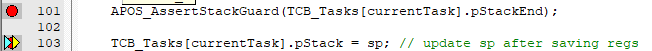
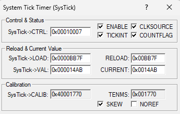
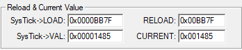
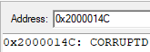
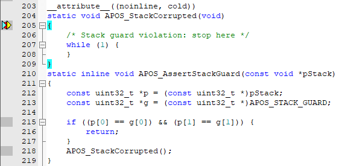

# Aufgabe 2: Stackguard

Der Stackguard wird bei jedem Taskswitch geprüft.
ALs Stackguard wird ein 8 byte string verwendet, der bei der initialisierung an das Ende jedes Taskstacks geschrieben wird: #define APOS_STACK_GUARD "STACKEND"

before
after

Stackguard runtime Berechnung: 0x14Ab - 0x1485 = 0x26
Dies entspricht 38 Cycles in dezimal.
Mit CoreClock 48MHz ergibt sich ein Laufzeitoverhead durch den Stackguardcheck von 38*1/48MHz = 792ns.

Die gemessene Laufzeit gilt ausschließlich für den Normalfall mit intaktem Stack-Guard.
Im Fehlerfall entsteht ein zusätzlicher Laufzeit-Overhead, der jedoch keine praktische Relevanz besitzt, da die Applikation in diesem Szenario in einen Fehlerzustand übergeht.

Fehlerfall:

Händische Änderung des Stackguards:

Der Stack-Guard funktioniert wie vorgesehen. Bei einer Veränderung des Stack-Guards wird die Funktion APOS_StackCorrupted() aufgerufen, woraufhin die Applikation in einer Endlosschleife verbleibt.